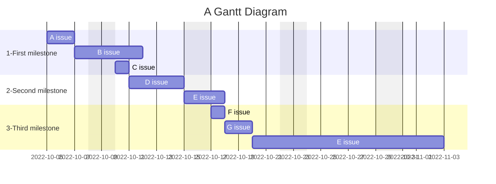

```mermaid
gantt
	title A Gantt Diagram
	dateFormat  YYYY-MM-DD
	excludes    weekends

	%% section Section
	%% A task           :a1, 2014-01-01, 30d
	%% Another task     :after a1  , 20d
	%% section Another
	%% Task in sec      :2014-01-12  , 12d
	%% another task      : 24d


section 1-First milestone
	A issue : a0, 2022-10-05, 2d  
	B issue : a1, 2022-10-07, 3d  
	C issue : a2, 2022-10-10, 1d  


section 2-Second milestone
	D issue : a3, 2022-10-11, 4d  
	E issue : a4, 2022-10-15, 2d  


section 3-Third milestone
	F issue : a5, 2022-10-17, 1d  
	G issue : a6, 2022-10-18, 2d  
	E issue : a7, 2022-10-20, 10d  


```
